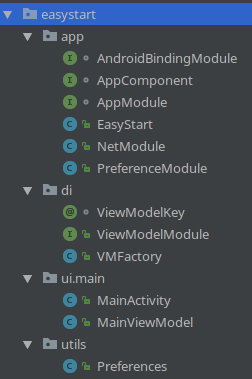

Easy Start
==========

Easy Start is a New Project template with configured dependency injection using Dagger2.

Project uses ViewModelFactory to inject dependencies into ViewModel classes.

Gradle module file contains various libraries implementations and has Java8 support enabled.



Features:
- Most popular libraries are already added to the gradle dependencies. Uncomment what you need and get started.
- Want to use the Architecture Components' ViewModel? It's ready to use with dependencies waiting to be injected into the constructor.
- Need Retrofit for API calls? It's been included too!
- Need Shared Preferences to store API token? Just inject them anywhere!
- StrictMode has been set to detect all issues.

Usage
=========
Just download this project and rename package name to the one you want and that's all.

```git clone https://github.com/mattdrzazga/EasyStart.git```
